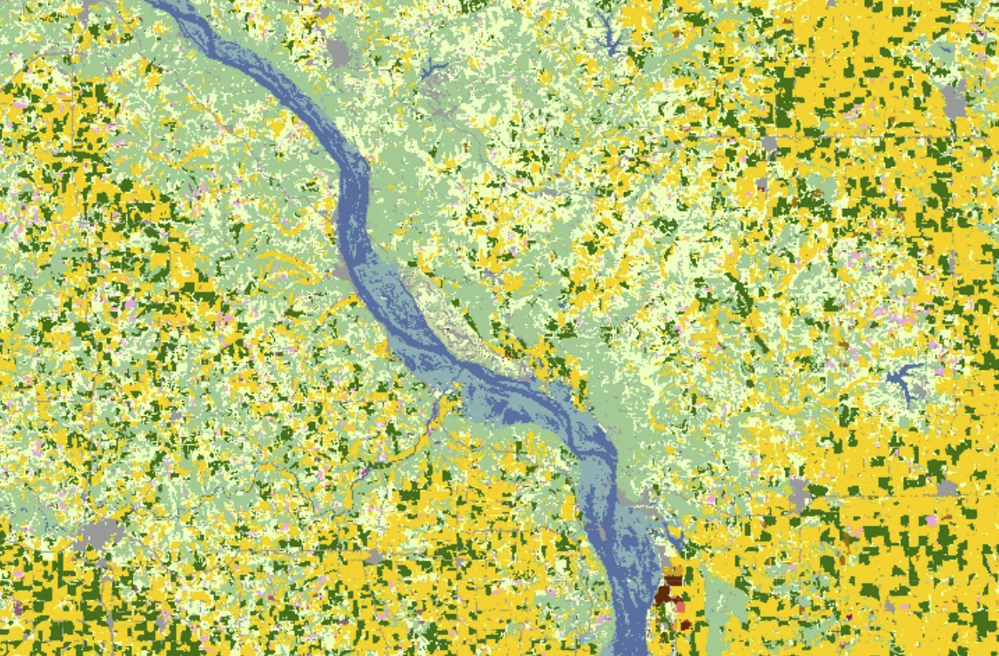

# Crop yield prediction using gradient boosting and geospatial data

This is my crop yield prediction project repository. It contains all the necessary information to reproduce the results of my **[paper](./paper.pdf)** on the subject as well as the explanation of the key techniques, ideas and results.

**The main** idea behine the research is to develop a gradient boosting model that would give yearly yield predictions for corn and soybean crops in 13 states of interest using geospatial data. The data was collected using Google Earth Enigne service as well as USDA statistical database and later transformed to tabular format so as to apply classical machine learning techniques.

---

## Contents

+ [***Requirements for replication***](#Requirements-for-replication)
+ [***Data sources and retrieval***](##Data-sources-and-retrieval)
+ [***Models and results***](#Models-and-results)

---

## Requirements for replication

The requirements to replicate the results: 
+ Knowledge of Python and machine learning
+ Basic Knowledge of JavaScript
+ [Google Earth Engine developper account](https://developers.google.com/earth-engine)

The required packages are contained in the [requirements.txt](requirements.txt) file and can be installed via pip file manager

---

## Data sources, retrieval and preprocessing

In the researh I used the following datasets from [Google Earth Engine](https://earthengine.google.com/):
+ [TIGER: US Census States 2018](https://developers.google.com/earth-engine/datasets/catalog/TIGER_2018_States) for US states boundaries
+ [USDA NASS Cropland Data Layers](https://developers.google.com/earth-engine/datasets/catalog/USDA_NASS_CDL) for Crop Layers
+ [MOD13Q1.061 Terra Vegetation Indices 16-Day Global 250m](https://developers.google.com/earth-engine/datasets/catalog/MODIS_061_MOD13Q1#description) for NDVI index
+ [MOD11A2.061 Terra Land Surface Temperature and Emissivity 8-Day Global 1km](https://developers.google.com/earth-engine/datasets/catalog/MODIS_061_MOD11A2) for surface temperature
+ [ERA5-Land Monthly Averaged - ECMWF Climate Reanalysis](https://developers.google.com/earth-engine/datasets/catalog/ECMWF_ERA5_LAND_MONTHLY) for precipitation data

The data was retrieved using Google Earth Engine [code editor](https://code.earthengine.google.com) using JavaScrip [code](js_code.js) presented in the repository.

The code allows to select the states of interest:

Apply the crop mask:

Crop mask             |  Crop mask: closer          |  Crop mask: closest          |
:-------------------------:|:-------------------------:|:-------------------------:
  |   | 

Sample the data within the boundaries of each state:

Plot the data for each year on a Google server and extract it in a .csv format.
The obtained data is quite raw and can be preprocessed using any desirable software. 
The final datasets are available in [data](data) folder, where each dataset corresponds the a certain period (data_march, for instance, uses data only up to March for prediction). See additional details about data preparation in the [paper](paper.pdf)

---

## Models and results

Three models have been trained on the given data:
+ Linear Regression
+ Decision Trees
+ Gradient Boosting Over Decision Trees (CatBoost implementation)

All three models were trained on four data time-spans: up to March, June, August and including all the year.

The models were trained for two metrics:
+ $RMSE(\hat{y}, y) = \sqrt{MSE(\hat{y}, y)} = \sqrt{\frac{1}{n}\sum_{i=1}^{n}(\hat{y_i}-y_i)^2}$
+ $R^2(\hat{y}, y) = 1 - \frac{\sum_{i=1}^{n}(y_i - \hat{y_i})^2}{\sum_{i=1}^{n}(y_i - \bar{y_i})^2}$

The follwing results were achieved:

---

